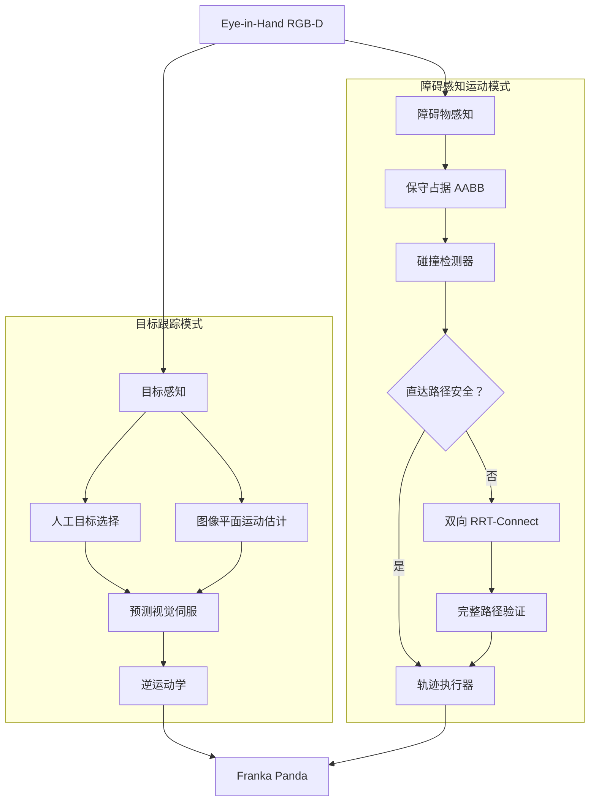

# 基于预测视觉伺服与障碍感知路径规划的 Eye-in-Hand 机械臂

**PyBullet Franka Panda · OpenCV · RGB-D · RRT-Connect**

这是一个 Eye-in-Hand 机械臂仿真系统，集成了视觉伺服、目标运动预测、RGB-D 感知、多目标选择、碰撞检测、RRT-Connect 路径规划以及障碍感知轨迹执行。

项目以 Franka Panda 为对象，构建了从 Eye-in-Hand RGB-D 感知、目标选择与预测跟踪，到视觉障碍物占据估计、碰撞检测、RRT-Connect 规划和真实关节轨迹执行的完整仿真链路。

**技术栈：** Python 3.10、PyBullet、OpenCV、NumPy、Pandas、Matplotlib

## 项目概述

传统视觉伺服根据当前图像误差产生控制指令，在目标快速运动时容易出现动态滞后。本项目从经过验证的 Eye-in-Hand 视觉伺服闭环出发，进一步加入图像平面运动预测、RGB-D 三维定位、多目标感知、保守障碍物占据估计、碰撞检测、RRT-Connect 路径规划以及电机驱动的轨迹执行。

系统形成了完整的机器人仿真链路：

**感知 → 决策 → 控制 → 规划 → 执行**

动态跟踪与障碍物路径规划是两个独立运行模式。预测视觉伺服用于控制动态目标跟踪；障碍物演示则验证并执行规划得到的关节空间路径。两套控制逻辑不会在同一时刻同时向机器人发送控制指令。

项目的主要技术工作包括：集成 Eye-in-Hand 预测视觉伺服；完成基准控制与预测控制的定量 A/B 实验；使用同一套 RGB-D 几何实现目标定位与障碍物感知；将视觉估计的占据区域接入碰撞检测与 RRT-Connect；最终打通从感知到真实电机轨迹执行的端到端仿真链路。这些属于系统集成与实验评价贡献，并不声称提出了全新的独立控制或规划算法。

## 核心功能

- PyBullet 中的 Eye-in-Hand RGB 与同步 RGB-D 图像采集。
- 基于 OpenCV 的红、绿、蓝多目标检测与人工目标选择。
- 基于有限差分图像速度和 EMA 滤波的预测视觉伺服。
- 从像素与深度反投影到相机坐标系和世界坐标系的 RGB-D 三维目标定位。
- 基于视觉的保守障碍物占据估计与整条机械臂连杆碰撞检测。
- 双向 RRT-Connect 规划，以及经过验证的 `POSITION_CONTROL` 轨迹执行。

## 系统架构



## 演示模式

### 演示一：预测动态目标跟踪

```powershell
python .\src\simulation.py --demo-tracking
```

用户可以在 PyBullet GUI 中拖动红色目标。系统通过 OpenCV 处理同步 RGB 图像，仅根据视觉测量估计目标速度和未来质心，并由预测视觉伺服持续更新 Panda 控制指令。目标丢失时机器人保持当前姿态，目标重新出现后自动恢复跟踪。

预测器和控制器均不读取目标的世界坐标。

### 演示二：多目标人工选择

```powershell
python .\src\simulation.py --demo-multitarget
```

红、绿、蓝三个目标从第一帧开始同时存在，默认选择红色目标。按 `1`、`2`、`3` 可分别选择红、绿、蓝目标。每个目标维护独立的运动估计器状态，只有当前选中的目标能够进入控制器。

程序不会根据计时器、目标距离或收敛状态自动切换目标。

### 演示三：障碍感知运动

```powershell
python .\src\simulation.py --demo-obstacle
```

固定场景会运行完整安全链路：

**RGB-D 障碍物检测 → 直达路径碰撞 → RRT-Connect → 路径验证 → 无碰撞电机执行 → 到达目标 → 保持**

发生碰撞的直达路径绝不会被执行。经过验证的规划路径会先进行稠密插值，再通过 PyBullet `POSITION_CONTROL` 真实驱动机械臂。障碍物真实几何信息仅用于最终评价，不参与规划或执行决策。

> 当前没有伪造演示 GIF。后续可以在真实录制演示后补充动图。

三个演示都会持续运行，直到用户按下 `Q`、`Esc`、`Ctrl+C`，或关闭 PyBullet GUI。

## 方法简介

### 视觉伺服与运动预测

对于图像中心 `(cx, cy)` 和检测到的目标质心 `(u, v)`，原始像素误差为：

```text
ex = u - cx
ey = v - cy
```

系统将视觉修正量从相机坐标系转换到世界坐标系，再通过逆运动学得到 Panda 关节指令。目标图像速度由连续 RGB 帧中的质心位置计算，并使用指数移动平均进行滤波。预测质心为：

```text
u_pred = u + u_dot * tau
v_pred = v + v_dot * tau
```

预测器的输入只有图像测量和时间戳，不使用目标世界坐标。

### RGB-D 三维定位与障碍物占据估计

系统将 RGB 质心或障碍物掩膜与同步的米制深度结合。利用相机内参把像素反投影为相机坐标系三维点，再通过 `T_W_C = T_W_E @ T_E_C` 转换到世界坐标系。仿真真值只用于实验评价。

对于障碍物，掩膜区域内的有效深度样本会形成可见表面点云。系统使用有意放大的世界坐标系 AABB 作为保守占据区域，优先保证真实障碍物覆盖率，而不是最大化可用自由空间。

### 碰撞检测与 RRT-Connect

每次运动首先检查关节空间直达路径。若直达路径安全，则直接执行；若发生碰撞，则在项目定义的活动关节子空间中调用双向 RRT-Connect。每一条树边和最终重建的完整路径都必须通过基于视觉占据区域的碰撞检测，验证成功后才能执行。

## 实验结果

下表全部来自可追溯的 Stage 23 汇总文件 [`outputs/final_report/final_metrics.csv`](outputs/final_report/final_metrics.csv)。所有结论仅适用于已测试的 PyBullet 场景。

| 能力 | 实验结果 |
|---|---:|
| 静态视觉伺服 | 5/5 收敛；最终平均 `|ex| = 1.4 px`、`|ey| = 2.0 px` |
| MEDIUM 预测视觉伺服 | RMSE 从 `8.091 px` 降至 `7.333 px`，改善 `9.37%` |
| FAST 预测视觉伺服 | RMSE 从 `9.912 px` 降至 `8.337 px`，改善 `15.89%` |
| RGB-D 目标定位 | 五个静态位置的平均三维误差为 `17.67 mm` |
| 多目标感知 | R/G/B 及三目标同时检测率均为 `100%`；颜色混淆次数为 `0` |
| 障碍物感知 | 检测率 `100%`；真实 AABB 覆盖率 `100%`；平均中心误差 `8.00 mm` |
| 碰撞检测 | `TP/TN/FP/FN = 7/7/6/0`；安全召回率 `100%` |
| RRT-Connect | 受测规划实验 `25/25` 成功；最终路径真实碰撞次数为 `0` |
| 轨迹执行 | 受测执行实验 `5/5` 成功；平均目标关节误差 `0.00196 rad`；真实碰撞次数为 `0` |

保守障碍物占据区域在覆盖 `100%` 真实 AABB 的同时，平均 AABB IoU 为 `40.82%`。这体现了面向安全的权衡：较大的占据范围降低了碰撞漏检风险，但会产生更多假阳性并减少可利用的自由空间。

<p align="center">
  
  
</p>
<p align="center">
  
  
</p>
<p align="center">
  
  
</p>

完整指标、数据质量说明和历史实验限制请参阅 [`docs/RESULTS.md`](docs/RESULTS.md)。

## 安装

已验证的项目环境：

- Windows 10/11
- Python 3.10

```powershell
git clone https://github.com/mtzdzzz/visual-servoing-robot.git
cd visual-servoing-robot

python -m venv .venv
.\.venv\Scripts\Activate.ps1
python -m pip install --upgrade pip
pip install -r requirements.txt
```

PyBullet 演示需要带有 OpenGL 支持的桌面环境。所有命令均应在项目根目录执行。

## 快速开始

```powershell
# 鼠标拖动红球，进行预测视觉跟踪
python .\src\simulation.py --demo-tracking

# 手动选择红、绿、蓝目标，按 1/2/3 切换
python .\src\simulation.py --demo-multitarget

# 运行固定的障碍物感知、规划与执行演示
python .\src\simulation.py --demo-obstacle
```

操作说明：

- 演示一：在 PyBullet 中选择并拖动红球。
- 演示二：`1` 选择红色，`2` 选择绿色，`3` 选择蓝色。
- 所有演示：按 `Q`、`Esc`、`Ctrl+C`，或关闭 PyBullet GUI 退出。

运行 `python .\src\simulation.py --help` 可以查看所有历史实验入口。

## 项目结构

```text
visual-servoing-robot/
├── src/
│   ├── simulation.py                 # 命令行解析与模式分发
│   ├── camera_observation.py         # 同步 Eye-in-Hand 图像采集
│   ├── camera_geometry.py            # 已验证的 RGB-D 几何计算
│   ├── visual_servo_runtime.py       # 共享视觉伺服运行逻辑
│   ├── target_motion_estimator.py    # 有限差分与 EMA 运动估计
│   ├── multi_target_detector.py      # 红、绿、蓝目标检测
│   ├── rgbd_localization.py          # 目标三维定位
│   ├── obstacle_detector.py          # RGB 障碍物掩膜检测
│   ├── obstacle_localization.py      # 点云与占据区域估计
│   ├── collision_checker.py          # 构型与路径碰撞检测
│   ├── rrt_connect_planner.py        # 双向 RRT-Connect 规划器
│   ├── trajectory_executor.py        # 电机驱动轨迹执行器
│   └── demo_*.py                     # 最终集成演示
├── docs/
│   ├── assets/                       # README 使用的精选图表
│   ├── EXPERIMENTS.md                # 实验复现说明
│   ├── RESULTS.md                    # 详细实验结果
│   └── GITHUB_RELEASE_CHECKLIST.md   # GitHub 发布检查表
├── outputs/
│   ├── final_report/                 # 最终指标、结论与图表
│   └── final_tables/                 # 工程审计与演示命令
├── requirements.txt
└── README.md
```

Stage 22 生成的完整模块清单位于 [`outputs/final_tables/project_structure.txt`](outputs/final_tables/project_structure.txt)。

## 实验复现

项目保留了各历史 Stage 的实验入口。实验目的、运行命令、输出文件和主要评价指标整理在 [`docs/EXPERIMENTS.md`](docs/EXPERIMENTS.md) 中。

重新运行实验前建议备份现有 `outputs/logs/`，因为部分实验脚本会覆盖同名输出文件。

## 局限性

- 目标和障碍物分割依赖人工配置的 HSV 颜色阈值。
- 当前验证仅在 PyBullet 仿真中完成，尚未进行真实机器人标定与硬件延迟实验。
- 障碍物几何使用简化的保守 AABB 表示，当前演示主要面向静态障碍物。
- 尚未完整实现机械臂自碰撞检测。
- RRT-Connect 只在项目定义的活动关节子空间中进行规划。
- 已测试场景不能证明系统具有实时保证或适用于所有环境的鲁棒性。

## 后续工作

- 将系统部署到真实 Franka Panda，并完成相机与机械臂标定。
- 使用学习型目标检测器替代仅基于颜色的分割方法。
- 增加动态障碍物停止与在线重新规划能力。
- 扩展到完整 7 自由度规划和自碰撞检测。
- 加入视觉抓取和更完善的状态估计方法，例如卡尔曼滤波。

## 项目背景与说明

本项目以递进方式构建为完整的机器人仿真与实验评价系统。项目价值主要体现在系统集成、工程实现和定量实验，而不是宣称提出新的独立算法。

README 中的所有核心指标均可追溯到保留的 Stage 23 汇总文件。详细结果页面同时保留了实验限制、数据质量问题以及未通过的历史评估，避免只展示最优结果。
