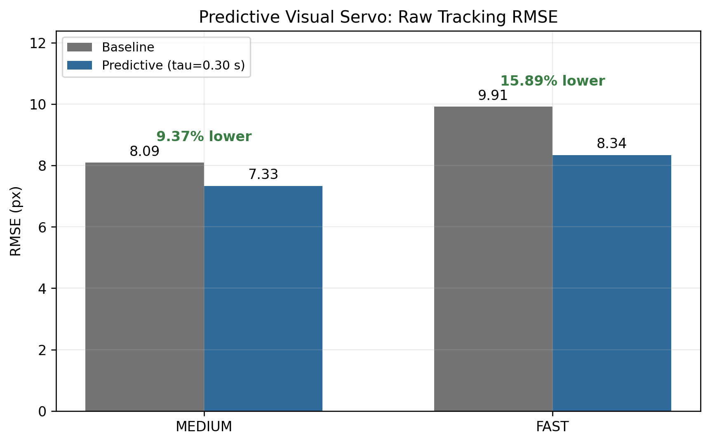
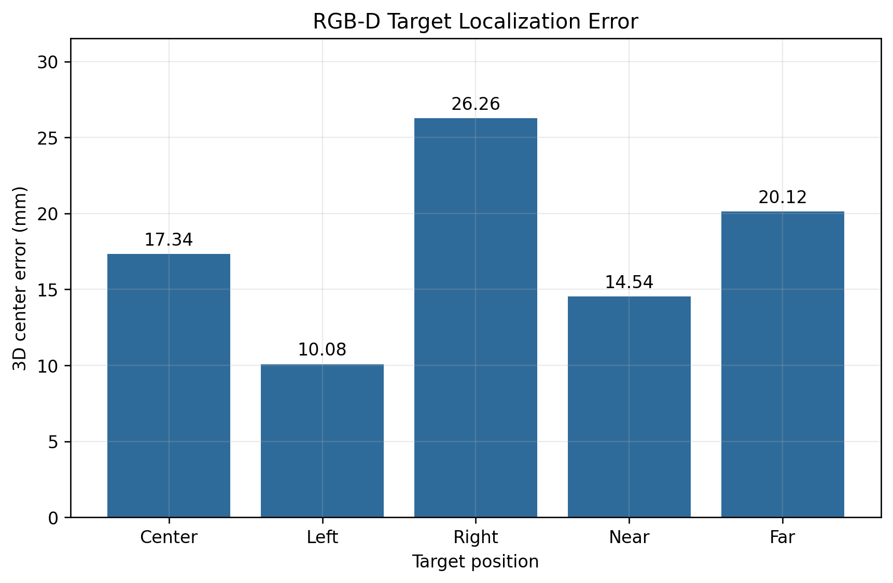
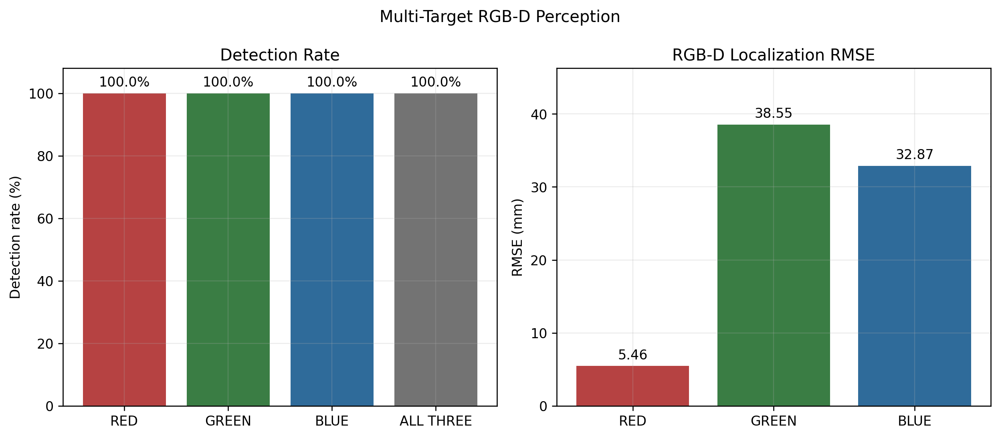
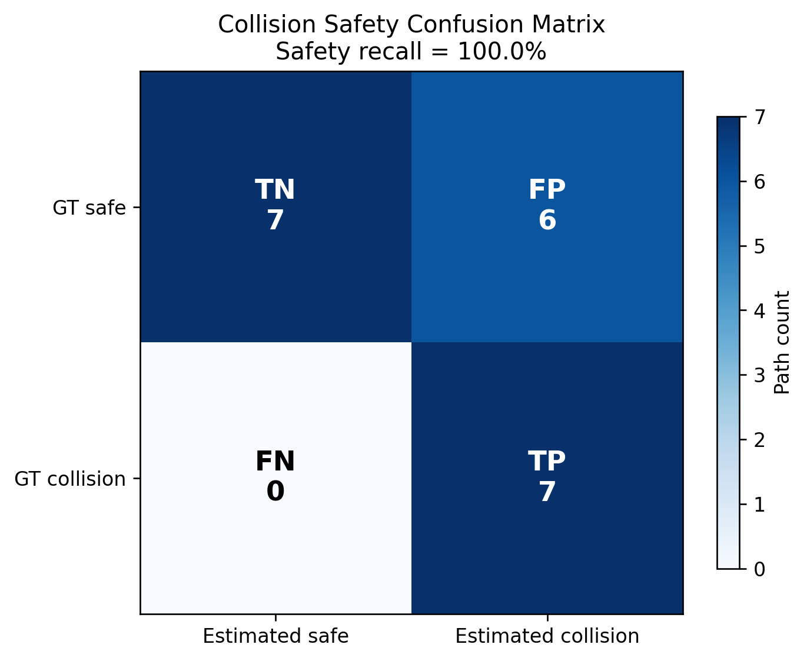
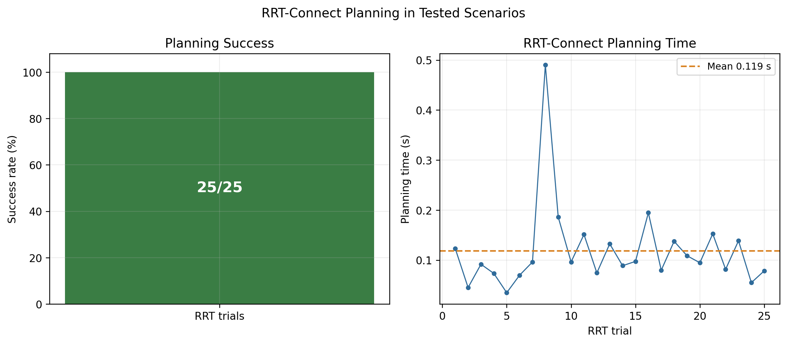
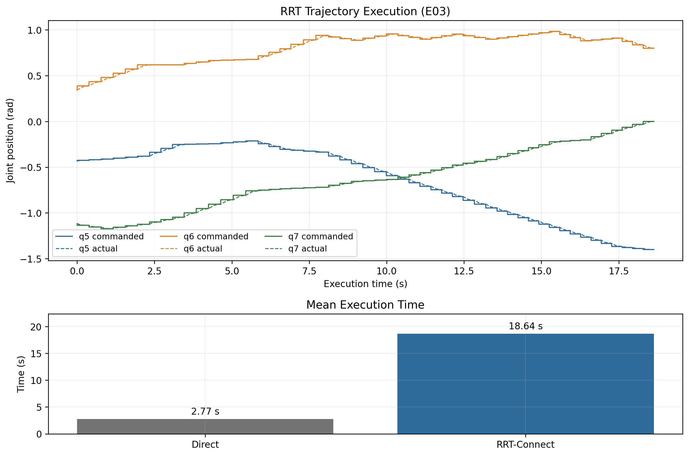

# Experimental Results

This page summarizes the preserved Stage 23 report. The authoritative machine-readable source is [`final_metrics.csv`](../outputs/final_report/final_metrics.csv); conclusions and methodology notes are in [`final_conclusions.md`](../outputs/final_report/final_conclusions.md). Values apply only to the tested PyBullet conditions.

## Visual Servoing and Robustness

| Experiment | Result |
|---|---:|
| Stage 7 static convergence | 5/5 trials (`100%`) |
| Mean final absolute error | `|ex| = 1.4 px`, `|ey| = 2.0 px` |
| Mean convergence time | `9.707 s` |
| Stage 9 SLOW RMSE / P95 | `6.597 / 10.198 px` |
| Stage 9 MEDIUM RMSE / P95 | `8.091 / 11.000 px` |
| Stage 9 FAST RMSE / P95 | `9.912 / 14.142 px` |
| Stage 9 detection rate | `100%` for all three speeds |
| Stage 10 target-loss duration | `2.500 s` |
| Stage 10 reacquisition / recovery | `0.000 / 0.133 s` |

The Stage 10 single-seed noise runs produced RMSE values of `8.091`, `7.913`, and `7.165 px` for 0, 1, and 3 px injected measurement noise. This non-monotonic result does **not** show that noise improves control; it only shows that the system did not become unstable within this particular 0–3 px test.

## Prediction and Predictive Visual Servoing

The simple Stage 12 online estimator at its original configuration did not outperform the current-centroid baseline (`0.899` vs `0.823 px` future-prediction RMSE). Offline Stage 12B then mapped the fixed alpha/horizon grid without changing online control. Stage 13 tested the predetermined predictor in the closed loop and evaluated performance using raw RGB tracking error.

| Motion | Baseline RMSE | Best tested predictive RMSE | Improvement |
|---|---:|---:|---:|
| MEDIUM | `8.091 px` | `7.333 px` (`tau = 0.30 s`) | `9.37%` |
| FAST | `9.912 px` | `8.337 px` (`tau = 0.30 s`) | `15.89%` |

Predictive compensation reduced RMSE for both evaluated motion levels and showed a larger relative benefit for FAST motion. This is an empirical result for the tested trajectories, not a universal guarantee.

## RGB-D Target and Multi-Target Perception

| Metric | Result |
|---|---:|
| Stage 14 mean / RMSE 3D error | `17.666 / 18.481 mm` |
| Stage 14 median / maximum 3D error | `17.338 / 26.256 mm` |
| Stage 15 R/G/B detection rate | `100% / 100% / 100%` |
| All-three-target detection rate | `100%` |
| Color confusion count | `0` |
| R/G/B localization RMSE | `5.462 / 38.549 / 32.871 mm` |

## Target Switching

The retained Stage 16 formal switching log contains six switch attempts, a `50%` success rate, `6.299 s` mean response time among successful switches, and `0` target-loss events. Its locked-joint maximum deviation was `0.02015 rad`, above the project's `0.005 rad` acceptance threshold; the historical formal Stage 16 evaluation is therefore retained as **FAIL**. Later manual demo behavior is validated separately and must not be confused with this historical formal result.

## Obstacle Perception and Collision Safety

| Metric | Result |
|---|---:|
| Obstacle detection rate | `100%` across five scenes |
| Mean / RMSE / maximum center error | `7.998 / 8.927 / 14.888 mm` |
| Mean GT AABB coverage | `100%` |
| Mean AABB IoU | `40.816%` |
| Estimated/GT volume ratio | `2.45` |
| Collision TP/TN/FP/FN | `7 / 7 / 6 / 0` |
| Precision / safety recall | `53.846% / 100%` |

The low IoU and six false positives are consistent with a conservative occupancy: it covers the real obstacle and reduces false-negative collision decisions, but removes more free space. It should not be interpreted as a complete geometric reconstruction.

## Planning and Execution

| Metric | Result |
|---|---:|
| Tested planning scenarios | `10` |
| Formal seeded RRT trials | `25` |
| RRT planning success | `25/25 (100%)` |
| Mean / median / maximum planning time | `0.119 / 0.096 / 0.490 s` |
| Mean RRT path length | `2.459 rad` |
| Final GT path collision count | `0` |
| Execution trials / success | `5 / 5 (100%)` |
| Mean direct / RRT execution time | `2.767 / 18.638 s` |
| Mean / maximum goal joint error | `0.001965 / 0.001979 rad` |
| Mean / RMSE / maximum tracking error | `0.01534 / 0.01993 / 0.04992 rad` |
| Locked-joint maximum deviation | `0.0000633 rad` |
| Execution GT collision count | `0` |

RRT-Connect achieved 100% success in the tested scenarios and seeds; this does not imply probabilistic completeness guarantees within a fixed time budget for arbitrary environments. All five tested execution trials reached their goals without ground-truth obstacle collision.

## Data-Quality Notes

- The Stage 7 summary file was incomplete/stale for one trial; Stage 23 recomputed static metrics from the five raw trial CSV files. One Trial 3 row lacks a timestamp, but the remaining ordered samples support the reported result.
- Stage 16 formal data mixes historical automated/manual selection behavior and fails its original acceptance criteria; it is reported transparently rather than used as a headline claim.
- Two Stage 19 near-boundary scenario rows were rejected before seeded RRT search because the goal configuration collided. The `25`-trial planning success statistic includes only formal seeded RRT searches.
- Stage 20 raw rows store the final `GOAL_REACHED` state rather than a per-sample state history; trajectory errors are still recomputed from commanded and actual joints.

## Scope Limitations

The system uses HSV segmentation, conservative AABB obstacle geometry, static-obstacle demonstrations, a project-defined active-joint planning subspace, and incomplete self-collision checking. Results are from PyBullet simulation and do not include physical calibration or hardware latency.
